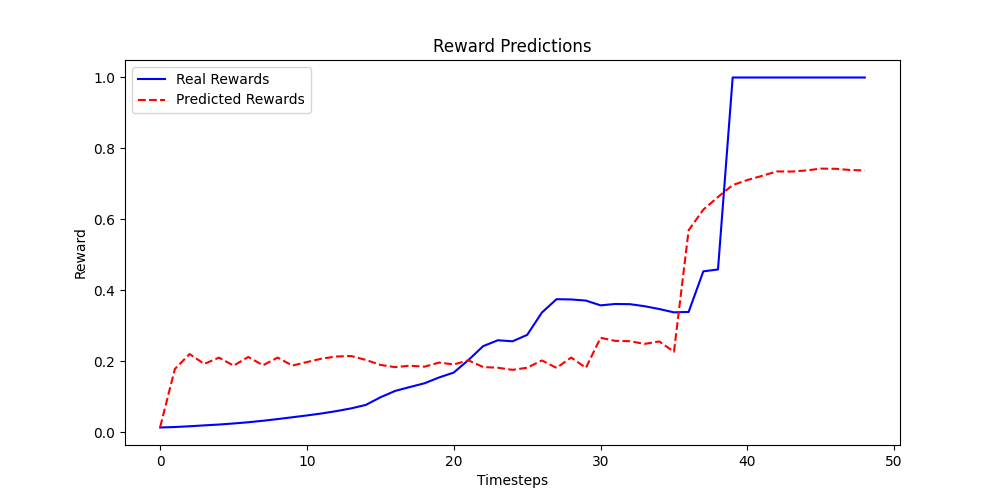

# Hybrid TD3-World Model for Robotic Learning in the Robosuite "Lift" Environment

This project implements a hybrid reinforcement learning framework that integrates a Twin Delayed Deep Deterministic 
Policy Gradient (TD3) agent with a world model. The Architecture for the TD3 model comes from Dr. Phil Tabor's course which you 
can find [here](https://www.udemy.com/course/actor-critic-methods-from-paper-to-code-with-pytorch/?kw=modern+reinfor&src=sac&couponCode=LEARNNOWPLANS).
 The system is designed to enhance sample efficiency and enable action
planning for robotic tasks, specifically in the Robosuite "Lift" environment.

## Table of Contents

- [Overview](#overview)
- [System Architecture](#system-architecture)
- [Project Structure](#project-structure)
- [Prerequisites](#prerequisites)
- [Setup and Installation](#setup-and-installation)
- [Usage](#usage)
  - [TD3 Model Training](#td3-model-training)
  - [Data Collection](#data-collection)
  - [World Model Training](#world-model-training)
  - [Hybrid Agent Training](#hybrid-agent-training)
  - [Testing and Visualization](#testing-and-visualization)
- [Results](#results)
- [Future Work](#future-work)

## Overview

This project combines model-free (TD3) and model-based (world model) reinforcement learning techniques:
- **TD3**: Trains a policy to complete tasks using real environment interactions.
- **World Model**: Simulates environment dynamics to generate synthetic data and aid in planning.
- **Hybrid Approach**: Uses real and imagined experiences for efficient learning and integrates planning for action selection.

The framework is tested in the "Lift" task, where a robotic arm manipulates an object to a target position.

## **System Architecture**

This project integrates a model-free reinforcement learning approach (TD3) with a model-based world model to create a hybrid system that enhances sample efficiency and enables planning in robotic learning tasks. The components are described below:

### **1. TD3 Model**
The TD3 (Twin Delayed Deep Deterministic Policy Gradient) model serves as the foundation for learning a policy to solve the task. Key features include:

- **Actor Network**: Maps state observations to continuous actions.
- **Critic Networks (Twin Critics)**: Two independent networks estimate Q-values, mitigating overestimation bias by taking the minimum Q-value during updates.
- **Replay Buffer**: Stores experiences for off-policy learning, improving sample efficiency and breaking temporal correlations.
- **Exploration Noise**: Gaussian noise is added to the actions during training to encourage exploration.
- **Target Networks**: Maintained for both actor and critic networks to stabilize learning via smoothed target updates.

### **2. World Model**
The world model simulates environment dynamics, predicting future states and rewards. It is trained on data collected by the TD3 model and incorporates:

- **Image Encoder (CNN)**: Processes raw image inputs into latent representations through convolutional layers and adaptive average pooling.
- **State Encoder (MLP)**: Encodes state vectors into the same latent space as the image encoder.
- **Recurrent State-Space Model (RNN)**: A GRU-based architecture that models latent dynamics, predicting future states and rewards.
- **Decoders**:  
  - **State Decoder**: Reconstructs states from latent representations.  
  - **Reward Predictor**: Predicts rewards using latent states and actions.


### **Integration**
The hybrid system combines the strengths of both models:
- **TD3 for Policy Learning**: Learns an optimal policy from real environment interactions.
- **World Model for Planning**: Imagines trajectories to guide decision-making and augment training data with synthetic experiences.
- **Imagination-Augmented Training**: The agent uses both real and imagined experiences to improve sample efficiency and learning speed.

## Project Structure

- **`td3_torch.py`**: Implementation of the TD3 agent.
- **`world_model.py`**: Neural network architecture for the world model.
- **`data_collection.py`**: Script to collect state-action-reward data and synchronized video frames.
- **`world_model_training.py`**: Script to train the world model.
- **`hybrid_td3.py`**: Implementation of the hybrid agent.
- **`trajectory_generator.py`**: Generates trajectories using the world model.
- **`model_based_planning.py`**: Implements action planning with the world model.
- **`test_world_model.py`**: Tests and visualizes predictions from the world model.

## Prerequisites

- Python 3.7+
- PyTorch
- Robosuite
- NumPy
- Matplotlib
- torchvision
- imageio

## Setup and Installation

1. Clone the repository:
   ```bash
   git clone https://github.com/Ctdunn/td3-hybrid.git
   cd td3-hybrid
   ```

2. Install dependencies:
   ```bash
   pip install -r requirements.txt
   ```

3. Download Robosuite and verify its installation:
   ```bash
   pip install robosuite
   ```

## Usage

### TD3 Model Training
1. Edit `td3_main.py` to configure training parameters.
2. Run the script:
   ```bash
   python td3_main.py
   ```
### Test TD3 Model
1. Set the episode number for how many episodes you would like (currently set to 3).
2. Run the script:
   ```bash
   python test.py
   ```
3. This will display a window with the robotic arm performing the task.
### Data Collection
1. Use the trained TD3 model to collect data:
   ```bash
   python data_collection.py
   ```

2. Data will be saved in the `states` and `videos` directories.

### World Model Training
1. Train the world model using the collected data:
   ```bash
   python train_world_model.py
   ```

2. Checkpoints will be saved in the current directory.

### Testing and Visualization
1. Test the world model's predictions:
   ```bash
   python test_world_model.py
   ```

2. Visualize planned and real trajectories using the planner:
   ```bash
   python model_based_planning.py
   ```

### Hybrid Agent Training
1. Train the hybrid TD3-world model agent:
   ```bash
   python hybrid_td3.py
   ```

2. Models and reward history will be saved in the `tmp/hybrid_td3` directory.


## Results
The World Model has currently only been trained for around 4 epoch due to lack of CUDA device at the time. 
However, even with such a small training cycle the initial results produced with **`test_world_model.py`** 
was able to generate promising results . 
When a full world model training cycle has been completed results will be updated here.

## Future Work

- Complete training, evaluate results, and modify as needed.
- Scaling to more complex tasks and multi-robot scenarios.
- Integrating alternative imagination strategies.
- Exploring additional planning techniques for hybrid systems.


